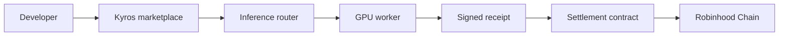

<div align="center">
  

  # Kyros

  **The open marketplace for pay-per-call AI inference.**

  Rent spare GPU capacity, route an inference request, and settle only for completed work.

  [Live app](https://usekyros.vercel.app) · [Documentation](./docs/README.md) · [Robinhood Chain](https://robinhoodchain.blockscout.com)
</div>

---

## What is Kyros?

Kyros is a product prototype for a decentralized inference marketplace. GPU owners list available capacity and supported models; developers choose a provider by model, price, latency, and region; settlement is designed to happen per verified inference call on Robinhood Chain.

The current repository ships the complete interactive frontend. Wallet connection and Robinhood Chain switching are implemented. Provider capacity, inference execution, receipts, and settlement are currently simulated and are documented as the next protocol layer to build.

> Kyros is an independent prototype. It is not an official Robinhood product and is not endorsed by Robinhood.

## Product experience

- Search and filter inference providers by model, GPU, and region.
- Compare per-call price, latency, uptime, and available workers.
- Connect an injected EVM wallet and switch to Robinhood Chain (chain ID 4663).
- Open an inference checkout and run a clearly labeled simulated call.
- Explore the provider-side value proposition and protocol flow.
- Use a responsive, motion-rich interface with reduced-motion support.

## Current status

| Area | Status |
| --- | --- |
| Marketplace UI | Implemented |
| Provider discovery and filtering | Implemented with seeded demo data |
| EVM wallet connection | Implemented |
| Robinhood Chain add/switch | Implemented |
| Inference execution | Simulated |
| Signed inference receipts | Planned |
| Onchain settlement contracts | Planned |
| Provider worker and registry | Planned |

The numbers shown in the hero and provider cards are illustrative demo data, not live network metrics.

## Architecture



Today, this repository implements the marketplace experience and wallet/network interaction. The router, worker, receipt verifier, and settlement contract are the planned backend and protocol services.

## Run locally

Requirements:

- Node.js 22.13 or newer
- npm
- An injected EVM wallet if you want to test wallet connection

```bash
git clone https://github.com/0xNexuz/kyros.git
cd kyros
npm install
npm run dev
```

Open [http://localhost:3000](http://localhost:3000).

Build the Cloudflare/Vinext target:

```bash
npm run build
```

Build the Vercel static target:

```bash
npx vite build --config vercel.vite.config.ts
```

## Deployment

- Production: [usekyros.vercel.app](https://usekyros.vercel.app)
- Private Sites build: [kyros.elllbest7.chatgpt.site](https://kyros.elllbest7.chatgpt.site)
- Vercel uses `vercel.json` and `vercel.vite.config.ts`.
- Sites uses Vinext, `vite.config.ts`, and `.openai/hosting.json`.

## Documentation

The GitBook-ready handbook lives in [docs](./docs/README.md). Its navigation is defined in [docs/SUMMARY.md](./docs/SUMMARY.md), and `.gitbook.yaml` points GitBook at that directory.

## Contributing

Issues and focused pull requests are welcome. Before changing protocol behavior, read [Current implementation](./docs/product/current-implementation.md) so prototype behavior is not mistaken for production infrastructure.

## Security

Do not use the current prototype to send funds or production inference traffic. No settlement contracts or receipt-verification services are included yet. Please report security concerns privately to the repository owner rather than opening a public exploit report.

## License

No open-source license has been selected yet. All rights are reserved until a license file is added.
