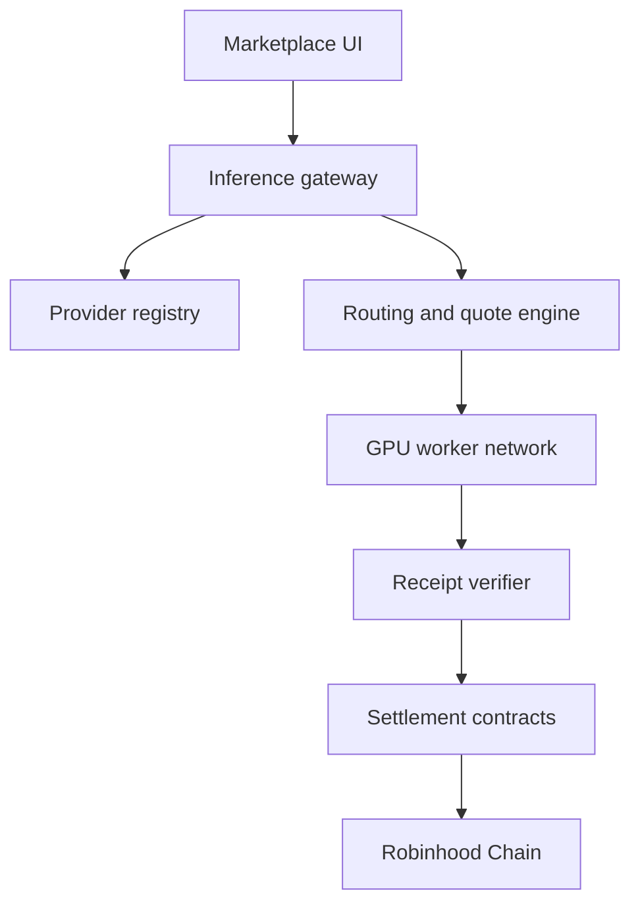

# Architecture

## Repository layout

```text
app/
  page.tsx               Marketplace and interaction state
  layout.tsx             Metadata and application shell
  globals.css            Theme, motion, and responsive styling
components/ui/           Reusable interface primitives
public/                  Logo, favicon, hero, and social assets
docs/                    GitBook source
vercel-main.tsx          Vercel React entry point
vercel.vite.config.ts    Vercel static build
vite.config.ts           Vinext/Sites build
```

## Frontend

The interface is a React 19 client component. Marketplace records are seeded in `app/page.tsx`, and search/filter state is local to the page. The visual system uses Tailwind CSS 4, Shadcn-compatible primitives, Base UI, and Lucide icons.

## Dual deployment targets

### Vercel

`vercel.json` runs:

```bash
npx vite build --config vercel.vite.config.ts
```

The output is a static client application in `vercel-dist/`.

### Sites / Cloudflare

`npm run build` runs `vinext build` and creates a Cloudflare Worker-compatible application in `dist/`.

## Target protocol services



These services are architectural targets, not components shipped in the current repository.
