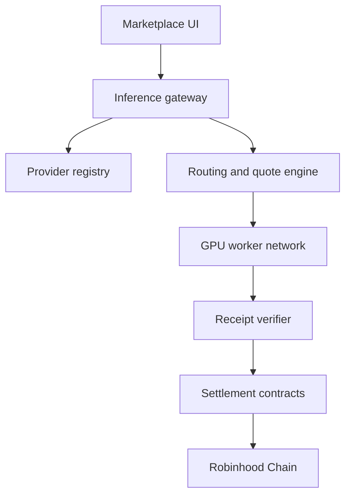

# Architecture

## Repository layout

```text
app/
  page.tsx               Overview route
  market/page.tsx        Marketplace route
  providers/page.tsx     Provider onboarding route
  docs/page.tsx          Documentation route
  api/inference/route.ts Sites pilot adapter
  layout.tsx             Metadata and application shell
  globals.css            Theme, motion, and responsive styling
components/roox-app.tsx  Shared visual shell and page interactions
components/documentation.tsx In-app documentation
components/ui/           Reusable interface primitives
lib/pages.ts             Route map and per-page metadata
lib/inference-gateway.ts Server-only operator pilot
api/inference.ts         Vercel pilot adapter
tests/                   Routing and mocked-worker safety tests
public/                  Logo, favicon, hero, and social assets
docs/                    GitBook source
vercel-main.tsx          Vercel React entry point
vercel.vite.config.ts    Vercel static build
vite.config.ts           Vinext/Sites build
```

## Frontend

The interface is a React 19 client component. Marketplace records are seeded in `components/roox-app.tsx`, and search/filter state is local to the page. The visual system uses Tailwind CSS 4, Shadcn-compatible primitives, Base UI, and Lucide icons.

## Dual deployment targets

### Vercel

`vercel.json` runs:

```bash
npx vite build --config vercel.vite.config.ts
```

The output contains one static HTML entry per page in `vercel-dist/`. `cleanUrls` serves `/market`, `/providers`, and `/docs` directly. A separate Vercel Node function handles `/api/inference`. Unknown page paths return 404.

### Sites / Cloudflare

`npm run build` runs `vinext build` and creates a Cloudflare Worker-compatible application in `dist/`.

## Target protocol services



This diagram is the target network. Only a limited operator pilot gateway is shipped, not the registry, routing/quotes, worker network, verification, or settlement services. The pilot is disabled until configured and is not used by the browser checkout. See [Private inference pilot](inference-pilot.md).
