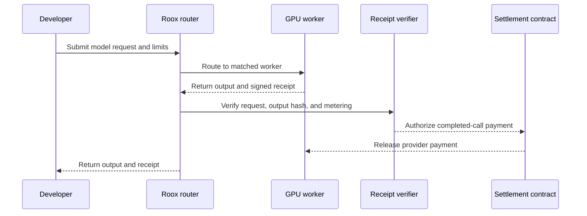

# How Roox works

Roox separates discovery, execution, verification, and payment.

## 1. Match

The marketplace exposes model, GPU, region, price, latency, uptime, and available worker count. A production router can use these fields with developer constraints to select a provider.

## 2. Infer

The target router forwards the request to a registered worker serving the selected model. The worker returns the model output plus metering information.

## 3. Verify

The target receipt binds together:

- request identifier
- model and provider
- request and response hashes
- measured usage
- quoted price
- timestamps and nonce
- worker signature

## 4. Settle

After verification, a settlement contract releases the agreed payment on Robinhood Chain. Failed, expired, or invalid calls should not settle.


The current application demonstrates this journey in the UI. Routing, signatures, verification, and settlement are not implemented in this repository yet.

